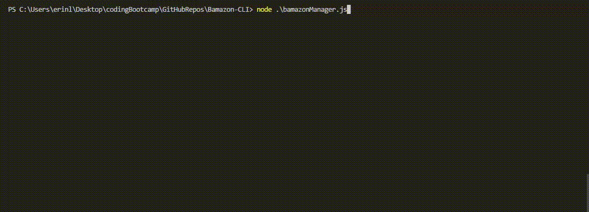

# Bamazon-CLI

The purpose of this application is to develop an Amazon-like storefront using Node.js and MySQL. Using a command-line interface (CLI), a user can view inventory, place orders, add or replenish stock, add a new department, and view aggregate sales by department. 

**Bamazon-CLI** uses the following packages:
* mySQL: access mySQL databases with nodeJS
* inquirer: provide user prompts 
* cli-table: display query results in a tabular format 

[mySQL]: https://www.npmjs.com/package/mysql
[inquirer]: https://www.npmjs.com/package/inquirer
[cli-table]: https://www.npmjs.com/package/cli-table

## node .\bamazonCustomer.js

The customer node app presents a list of the available products and allows the user to choose an item and quantity to purchase. If the user has attempted to order more units of an item than is currently available in stock, the user is notified of the insufficient quantity and prompted to choose again. Otherwise, an invoice is returned, consisting of the unit price, quantity ordered, and invoice total.

## node .\bamazonManager.js

The manager node add presents a list of options and allows the user to:
* **View all products**: returns a list of all products including the name, department, price, and available stock
* **View products with a low inventory**: only returns products with fewer than five in stock
* **Add stock to inventory**: choose a product and enter quantity to add
* **Add a new product**: enter a new product's name, department, price, and availabile stock
* **Exit**: exit the Node.js program 

## node .\bamazonSupervisor.js

The supervisor node app presents three options: view product sales by department, create a new department, or exit. Viewing product sales by department aggregates a sum of each product's sales by department and displays the results in a tabular format in the terminal. Creating a new department allows the user to input the name, and over head cost of a new department. Exit allows the user to exit the Node.js program.

